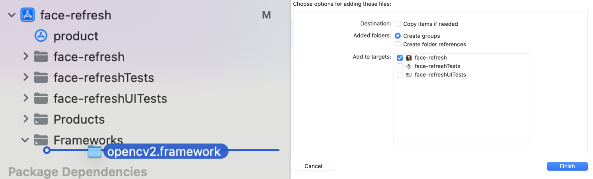
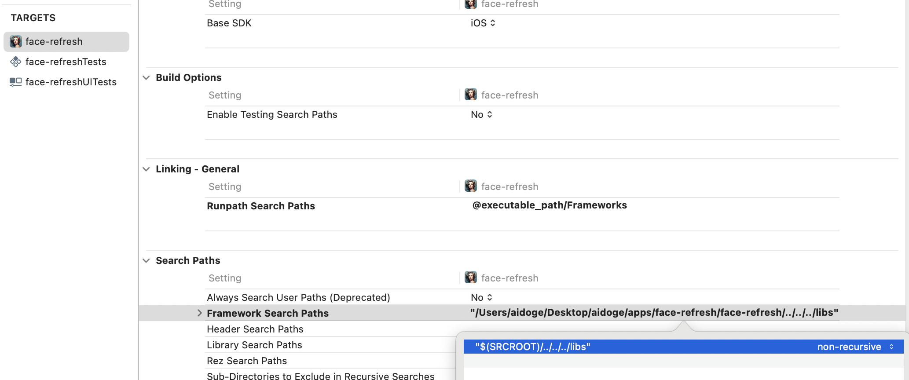
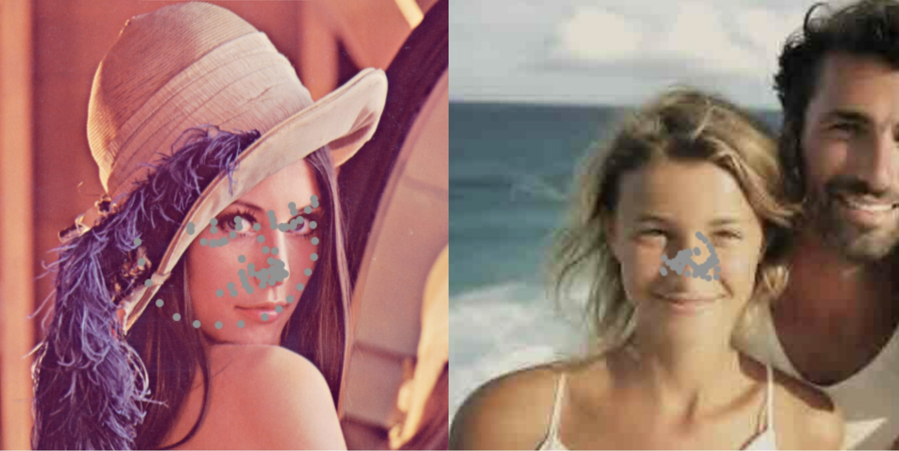
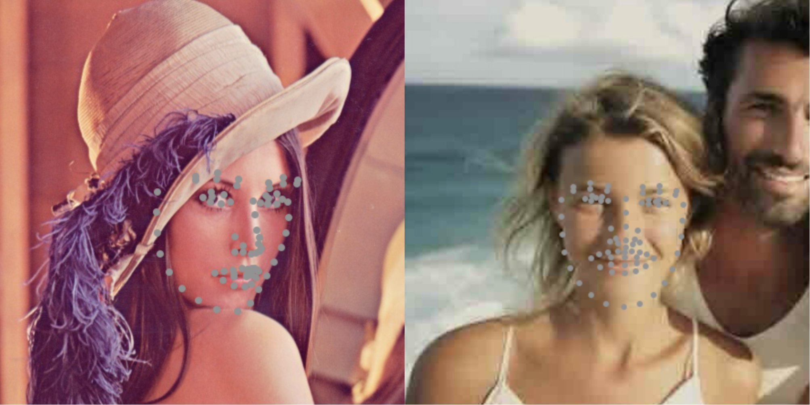
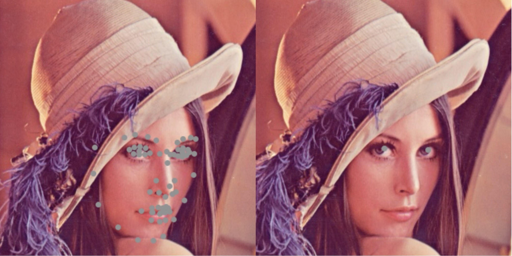
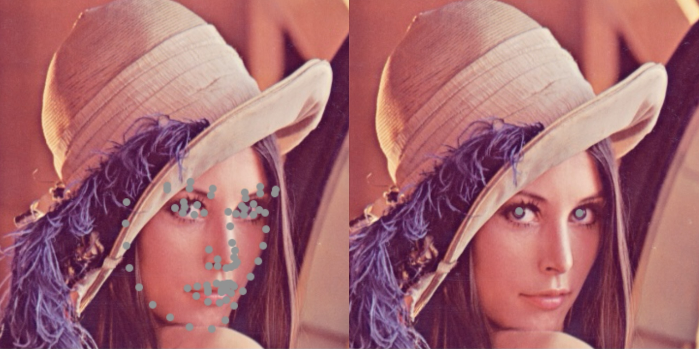

# Sharing Our Experience in Developing FaceRefresh

## Meet the App: Before the Code
Your memories are unique, priceless, and yours alone. As life moves on, it's these moments that matter most.
[FaceRefresh: AI Photo Restorer](https://apps.apple.com/app/facerefresh-ai-photo-restorer/id6463642671) is here to bring them back to life, vividly and securely, right on your device.

Key features:  
• Face Sharpening: Transform blurry faces into crisp, clear focal points.  
• Mosaic Removal: Eliminate pixelation specifically from faces for a smoother appearance.  
• Color Correction: Balance facial tones to restore natural colors.  
• Entirely On-Device Processing: All computations are performed entirely on your device, ensuring your data never leaves your phone.  


## How to Use OpenCV2 in a Swift Project
It's worth mentioning that our initial use of OpenCV was somewhat of a detour.

Firstly we downloaded the OpenCV2 framework (version 4.8) for iOS from the [official website](https://opencv.org/releases/),

Then we followed [a tutorial online](https://medium.com/pharos-production/using-opencv-in-a-swift-project-679868e1b798).
According to the tutorial we needed to configure Xcode and implement wrappers for the OpenCV2 functions we wanted to use. Despite following the tutorial step by step, we encountered various linking issues and couldn't resolve them even after checking every possible error point.

Later, we accidentally discovered that OpenCV2 already contains Swift code. So, theoretically, we shouldn't need to write custom wrappers. After some tinkering, we found that using it is actually quite simple. **All we needed to do was**:

1. Add OpenCV2 as a framework dependency in the project.
2. Configure the Framework Search Paths in Target > Build Settings to include the path where opencv.framework is located.

Here is a screenshot of the first step:


And here is a screenshot of the second step (the opencv.framework directory is placed under the libs folder):


One issue we encountered was that the package names for OpenCV in Python and Swift don't match. For example, in Python, we would use cv2.estimateAffinePartial2D and cv2.warpAffine, but in Swift, we should use Calib3d.estimateAffinePartial2D and Imgproc.warpAffine. The only workaround we found was to use grep within the downloaded opencv.framework.


Lastly, one inconvenience is that the framework downloaded from the official website cannot be compiled on a simulator; you have to compile it locally.


## Things to Be Cautious When Using iOS Vision Framework for Facial Landmark Detection

### Vision Framework Cannot Be Used for Facial Landmark Detection on Simulators
When developing the FaceRefresh app, it were our first time using the Vision framework. We weren't aware that:
1. The coordinate system returned by all APIs is different from the display coordinate system on the iPhone (the y-axis is flipped).
2. Facial landmark detection can only be done on a real device.
Initially, we encountered an error:
```
Error Domain=com.apple.Vision Code=9 
"encountered an unexpected condition: Unspecified error" 
UserInfo={NSLocalizedDescription=encountered an 
          unexpected condition: Unspecified error}
```

However, we found a switch (landmarksRequest.usesCPUOnly = true) that allowed the code to run, but the detected landmarks were incorrect.

```swift
    let landmarksRequest = VNDetectFaceLandmarksRequest()
    landmarksRequest.constellation = VNRequestFaceLandmarksConstellation.constellation76Points
    landmarksRequest.revision = VNDetectFaceLandmarksRequestRevision3

    // use cpu here
    landmarksRequest.usesCPUOnly = true

    let requestHandler = VNImageRequestHandler(ciImage: image, options: [:])
```
Here are the results when running on a simulator (on an M1 MacBook):


And here are the results on a real device (also with useCPUOnly = true enabled):


Both issues combined led to a lot of debugging time. Initially, we realized that we had made mistake #1 and corrected it. However, at that time, we thought there might be other issues similar to mistake #1. It turned out that it was actually mistake #2 causing the problems.

### Choosing between constellation65Points and constellation76Points 

In FaceRefresh App, we only needed to detect a few key points like the pupils, nose tip, and mouth corners. Therefore, both constellation65Points and constellation76Points would work for me. However, after testing with a Lenna image, we found that constellation76Points gave more accurate results, which was not mentioned in the documentation.

Here are the results using constellation65Points:


And here are the results using constellation76Points:



Compared to constellation65Points, constellation76Points provided more accurate pupil and mouth corners positions.
